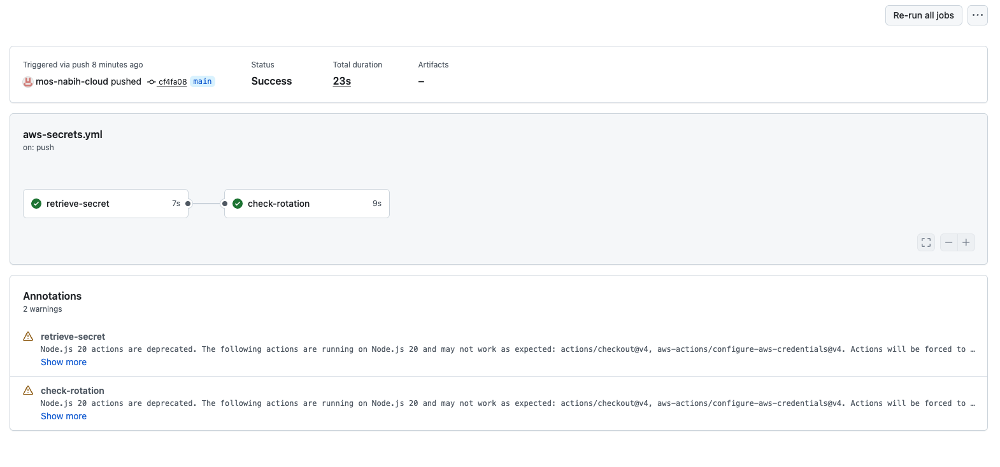
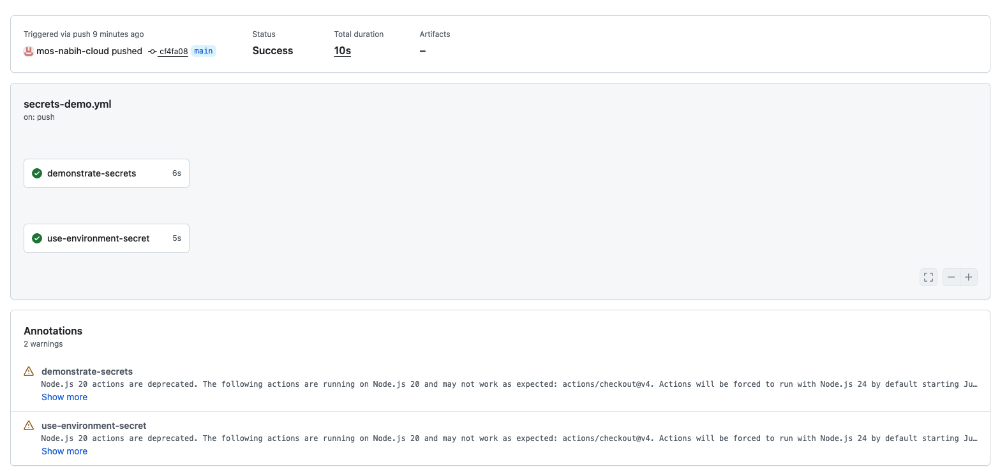
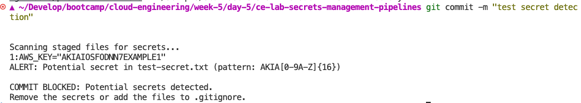

# Lab M5.08 - Secrets Management in Pipelines

- **Name** Mos
- **Date** 22.05.2026
 
## What This Project Does
Demonstrates secure secrets handling across GitHub Actions and AWS Secrets
Manager. Includes log masking, rotation-age checks, Terraform-provisioned
secrets, and a pre-commit hook that blocks accidentally committed credentials.
 
## Project Structure
 
```
.
├── .github/workflows/
│   ├── secrets-demo.yml        # GitHub Secrets masking demo
│   └── aws-secrets.yml         # AWS Secrets Manager retrieval
├── terraform/
│   ├── main.tf                 # Secrets Manager resources
│   ├── variables.tf
│   └── outputs.tf
├── scripts/
│   ├── check-secret-age.sh     # Rotation age checker
│   └── scan-secrets.sh         # Secret pattern scanner
├── .githooks/
│   └── pre-commit              # Pre-commit secret scan
├── .pre-commit-config.yaml
└── .gitignore
```
 
## Secrets Configured
- **GitHub Repository:** DB_PASSWORD, API_KEY
- **GitHub Environment (staging):** DEPLOY_TOKEN
- **AWS Secrets Manager:** database-credentials, api-keys
 
## How to Run
 
```bash
# Deploy AWS secrets
cd terraform && terraform apply && cd ..
 
# Run rotation check
./scripts/check-secret-age.sh "m508-secrets-lab/dev/database-credentials" 90
 
# Enable pre-commit hook
git config core.hooksPath .githooks
```

## Screenshots

### AWS Secrets Workflow


### Secrets Masking Demo


### Commit hook

 
## Key Decisions
- Used **::add-mask::** for dynamically retrieved secrets
- Terraform manages AWS Secrets Manager for auditability
- Pre-commit hook uses regex patterns matching gitleaks rules
